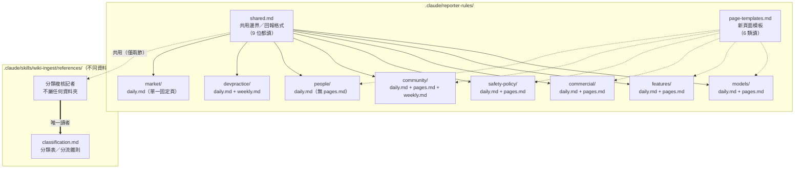

# 記者規則檔：共用檔案 vs 各自獨立資料夾（Markdown 版）

互動版見同目錄 `reporter-rules-files.html`（archify 產出）。本檔是同一份 `reporter-rules-files.architecture.json` 規格的 Mermaid 對照版。

依 `.claude/skills/wiki-ingest/SKILL.md` 與九份 `.claude/agents/wiki-reporter-*.md` 的「開始前必讀」清單查證，非推測。

## 怎麼看這張圖

- 實線箭頭＝每次派工都讀的共用檔；虛線箭頭＝只有需要建新頁時才讀
- 兩個大框是實際的資料夾邊界——分類複核記者住在完全不同的資料夾（`wiki-ingest/references/`），不算 `reporter-rules/` 的一份子

## 共用的部分

- `shared.md`：九位記者全部要讀（分類複核記者只讀其中兩節：規則檔優先於派工訊息、注入防護）
- `page-templates.md`：只有會自己建新頁的六類記者讀，devpractice／market／分類複核記者都不讀

## 各自獨立的部分

- 六類記者每人一個資料夾，各自的 `daily.md`／`pages.md` 互不相通——**`people/` 是唯一沒有 `pages.md` 的**
- `devpractice/`、`market/` 各自多一份 `weekly.md`
- 分類複核記者連資料夾都沒有，直接讀 `wiki-ingest` 底下的 `classification.md`

派工時序見同目錄 `wiki-ingest-dispatch.md`。
