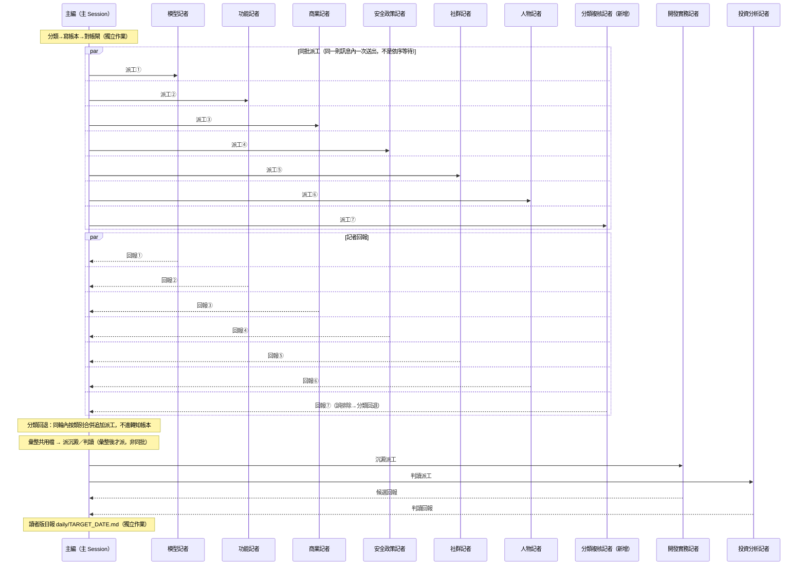

# Wiki Ingest 記者派工循序圖（Markdown 版）

互動版見同目錄 `wiki-ingest-dispatch.html`（archify 產出，含 Guided Views 點擊亮路徑、hover 預覽、Path/Map/Lens 工具）。本檔是同一份 `wiki-ingest-dispatch.sequence.json` 規格的 Mermaid 對照版，供不方便開瀏覽器時快速查閱。

只涵蓋 `/news-pipeline` 的 Step2（Phase B）——抓新聞產日報是另一段背景 Phase A、收尾發布是背景 Phase C，兩者皆非「記者」角色，不在本圖範圍。

## 共用規則 vs 特殊規則

- **六類記者**（模型／功能／商業／安全政策／社群／人物）共用同一套分類路由：依日報條目類別派工，各有負責頁面。
- **分類複核記者／開發實務記者／投資分析記者**——三者角色檔皆明文「與六類記者不同，不在分類路由內」：
  - 分類複核記者：讀主編當天排除、未派給任何記者的條目清單，覆核有沒有誤排除
  - 開發實務記者：不吃日報條目，吃本輪 ingest 寫進 wiki 的 diff
  - 投資分析記者：不吃分類路由，吃當日日報本身換市場框架重讀

檔案結構（誰讀哪份規則檔）見同目錄 `reporter-rules-files.md`。
