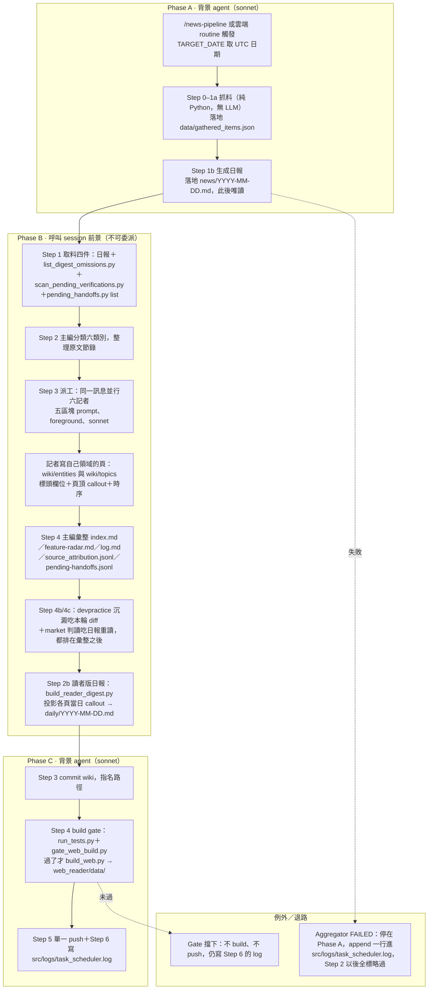
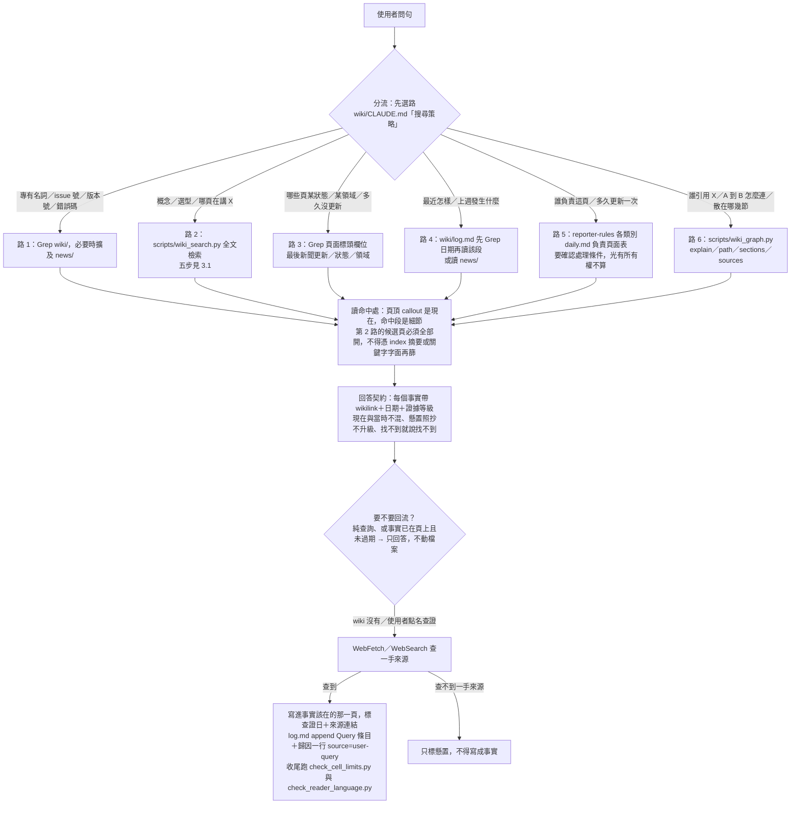
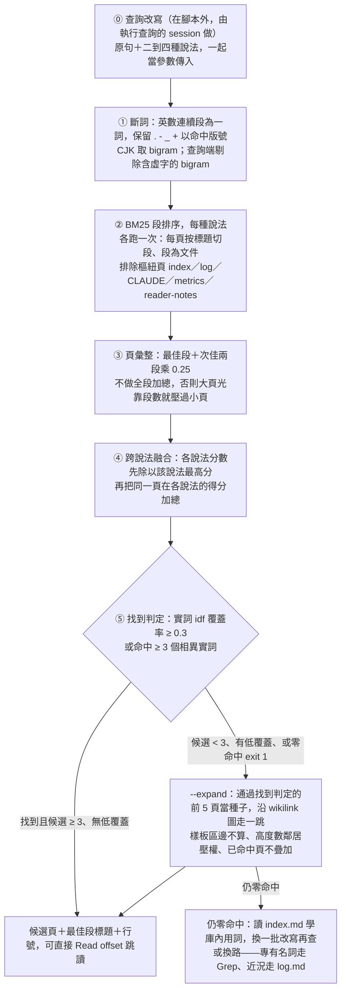

# Ingest 與 Query 的流程與資料契約

**建立：** 2026-09-14 ｜ **範圍：** `wiki/` 的寫入路徑（Ingest）與查詢路徑（Query），以及兩者交界的資料契約 ｜ **不含：** Lint（每週整理）的內部步驟，只標它在哪裡接手

寫這份的起因：Query 第 2 路的最後一塊在 2026-09-14 補完（commit `856249f4`，全文 BM25＋同義叢集＋`--expand` 圖擴散＋「候選頁全開」鐵則；同義叢集於 2026-09-17 改為查詢改寫，見第 5 節），機制散在 `wiki/CLAUDE.md`、`.claude/skills/wiki-query/SKILL.md` 與兩支 script 的 docstring 裡，沒有一處看得到全貌。本檔是那個全貌，不是新規則——執行時仍以各規則檔為準。

---

## 1. 一頁看懂

| 動作 | 輸入 | 產出 | 頻率 | 誰執行 |
|---|---|---|---|---|
| **Ingest** | `news/YYYY-MM-DD.md` 日報＋`list_digest_omissions.py` 列出的未進日報條目 | `wiki/entities/`、`wiki/topics/` 頁面、`wiki/index.md`、`wiki/feature-radar.md`、`wiki/log.md`、`data/source_attribution.jsonl`、`daily/YYYY-MM-DD.md` | 每日 | 主編＝呼叫 session；六記者為 foreground subagent（`.claude/skills/wiki-ingest/SKILL.md`） |
| **Query** | 使用者的問句 | 帶 wikilink＋日期＋證據等級的答案；必要時回寫頁面＋`wiki/log.md` Query 條目＋歸因 `user-query` | 隨時 | 任何 session 直接執行，不 spawn 子 agent（`.claude/skills/wiki-query/SKILL.md`「邊界」） |
| **Lint** | 既有 wiki | 修正矛盾／孤兒／過期、時段蒸餾封存 | 每週 | `/weekly`、`/wiki-lint` |

「每個事實只有一個家」（`wiki/CLAUDE.md`「資訊架構哲學」）**同時是寫入紀律與檢索前提**：寫入端因此知道一筆事實該落在哪一頁、別處只留 wikilink；查詢端因此可以「找到一個家就停」，並用那些 wikilink 當第二條找路的路徑（`--expand` 圖擴散與第 6 路走的就是這些邊）。副本一多，兩端同時壞——檢索會撈到互相矛盾的版本，而寫入端不知道該改哪一份。

---

## 2. Ingest flowchart

Phase A／B／C 的切法與 `docs/architecture-archify/news-pipeline.workflow.json` 的 lanes 一致（Phase A 背景 agent、Phase B 呼叫 session 前景、Phase C 背景 agent、例外＝退路）；Phase B 內的主編／六記者／彙整後沉澱三層對齊 `docs/architecture-archify/wiki-ingest-orchestrator.workflow.json` 的 lanes。

要點（都在上列規則檔裡，本檔不新增規則）：

- **不可委派段＝Phase B 的 Step 2。** 記者必須 foreground 派出，背景記者的完成通知回不到派工 agent；記者自己也不得再呼叫 Agent tool。所以整條 pipeline 只有 A 與 C 外包給背景 agent，B 由呼叫 session 親自跑。
- **失敗退路不對稱：** Step 1a 失敗直接停（沒有日報就沒有可 ingest 的東西）；Step 2 失敗仍進 Phase C（web build 不依賴 wiki）；Step 2b 失敗不阻斷；唯一的閘是 Step 4 的 web build gate。
- **順序不是美學：** Step 2b 必須排在記者覆寫 callout 之後、commit 之前，它讀的就是那些 callout；4b／4c 必須排在彙整之後，因為它們吃的是已定稿的 diff 與已定稿的事實頁。
- **「沒看過」比「不收」嚴重：** 日報是給讀者的篩選結果，wiki 是沉澱層，所以 Step 1 一定要把未進日報的條目一起餵給記者——收不收由各記者的門檻決定，沒看過不行。

---

## 3. Query flowchart

### 3.1 第 2 路內部（`scripts/wiki_search.py`，隨需建索引、零落地檔案）

零命中的退路順序是固定的：**`--expand` → 換一批改寫 → 換路**。擴散排前面，因為它是既有 wikilink 免費給的結構訊號，不需要再猜一次用詞。

---

## 4. 兩條流的資料契約

Ingest 每一種產物，被 Query 的哪一路讀、以什麼方式讀：

| Ingest 產物 | 誰寫 | Query 哪一路讀 | 讀法 |
|---|---|---|---|
| 頁面標頭欄位（狀態／最後更新／最後新聞更新／領域） | 記者，每頁必做 | 路 3 | Grep 欄位字面，不逐頁閱讀；也是 `gen_wiki_frontmatter.py` 投影 frontmatter 的唯一來源 |
| 頁頂 delta-first callout | 記者，今日有實質更新的頁必寫 | 路 2 的最後一步 | 候選頁開啟後第一眼讀的「現在」；同時被 `build_reader_digest.py` 一字不改投影成 `daily/` |
| 頁面正文（現況／摘要／各主題區塊） | 記者 | 路 2 | BM25 全文，按標題切段排序，回傳最佳段標題＋行號 |
| `## 時序`／`## 歷史記錄` | 記者 prepend；lint 蒸餾後原文搬進 `-archive` 子頁 | 路 2（同樣被索引） | 檢索讀得到，但回答時必須標明那是「當時」，不得當成現在 |
| `wiki/index.md` 目錄表（頁面／類型／領域／狀態／一句鉤子） | 主編彙整 | 路 2 的**補挑**步驟 | 人或 agent 眼睛讀，**不進全文索引**——`wiki_search.py` 的 `EXCLUDE_PAGES` 明確排除 `index` |
| `wiki/feature-radar.md` | 主編＋模型／功能記者 | 路 2 | 與一般頁面同樣進 BM25 索引（不在排除名單） |
| `wiki/log.md` | 主編 append，一字不可改 | 路 4 | 先 Grep 日期定位再讀該段，永不整讀；同樣被 `EXCLUDE_PAGES` 排除在全文索引外 |
| 正文 `[[wikilink]]` | 記者（事實已有家就指路，不複製） | 路 6、路 2 的 `--expand` | 當成圖的邊：`wiki_graph.py` 的 explain／path／sections；擴散時樣板區（參考來源／相關實體／相關議題／使用指南）的邊不算 |
| `data/source_attribution.jsonl` | 主編，append only | 路 6 的 `sources <頁slug>` | 歸因帳本查原文：日期｜來源｜條目標題｜原始 URL；帳本 07-11 起收，更早的走日報 |

**為什麼 index 摘要只能做路由、不能做檢索**——三個獨立理由疊在一起：

1. **機械上讀不到。** `index` 與 `log` 都在 `wiki_search.py` 的 `EXCLUDE_PAGES` 裡。它們指向所有頁、含所有查詢詞，留在索引裡只會每題都排前面，等於沒有鑑別力（`wiki_graph.py` 的樞紐排除用的是同一組名單）。
2. **內容上不該讀到。** index 的內容紀律是「只放慢變的路由事實」，摘要是一句鉤子，不含頁面正文用詞。2026-09-14 的實例：問「agent 視覺化」，答案頁寫的是「可觀測性／協調地圖」，摘要一個字都沒沾到。
3. **所以「候選頁全開」是鐵則而不是建議。** 檢索面已經換成全文，篩選面若退回摘要或關鍵字字面，等於把換上的全文檢索又丟掉一次。

對稱地看：log 同樣被排除在全文索引外，所以「最近怎樣」這類問題**不可能**靠第 2 路答出來，必須走第 4 路的 Grep 日期——分流不是效率選擇，是能力邊界。

---

## 5. 設計取捨與已知缺口

### 為什麼不用向量嵌入

- **沒有 API key。** 根目錄 `CLAUDE.md`「環境限制」是硬規則：不得新增任何「有 API key 才能運作」的功能或 fallback，唯一合法的 LLM 路徑是 Claude session 直接執行。嵌入要呼叫模型，直接出局。
- **雲端沙盒 egress 封鎖。** `docs/daily-automation.md` 記載的實測：雲端沙盒封鎖一般外部網域，抓料因此被迫移到 GitHub Actions。任何要連外的檢索服務在每日路徑上跑不起來。
- **零依賴是刻意的。** `wiki_search.py` 不裝 jieba，CJK 用 bigram；索引隨需在記憶體建、不落地檔案（同 `wiki_graph.py` 的「沒有檔案就沒有過期問題」）。代價是每次查詢重掃 `wiki/`，在目前的頁數量級比維護一份會過期的索引便宜。

### 為什麼不養同義詞表

第 2 路上線時帶一份人工登記的同義叢集（data 目錄下的 search_aliases.json，8 組 70 詞），三天後拿掉。理由：跑 `wiki_search.py` 的永遠是 Claude session，它本來就知道「視覺化」和「可觀測性」是同一件事；靜態詞表是給不懂語意的呼叫端用的補丁，放在這裡只會多一份沒人看守、會靜默過期的資料。改成呼叫端當場改寫問句、腳本負責融合多種說法。代價是同一題兩次查詢的改寫可能不同，所以回報與 Query log 條目要列出用過的說法。

### 已知缺口

| 缺口 | 觸發條件 | 目前退路 | 未來選項 |
|---|---|---|---|
| 改寫品質取決於執行的 session | 改寫全都沒猜中庫內用詞，或把不相干的詞塞進同一種說法 | 先 `--expand` 走圖；仍零命中就讀 `wiki/index.md` 學庫內用詞再改寫一次；輸出的「改寫」行標出每種說法帶進幾頁，零頁的說法看得見 | 從 log 的 Query 條目統計零命中率趨勢（未實作） |
| 結果不完全可重現 | 同一題兩次查詢，session 給的改寫不同 | 回報與 Query log 條目列出用過的說法，事後可照抄重跑 | 無；這是拿掉詞表的代價 |
| 圖擴散只走一跳 | 答案頁與命中頁之間隔著一個中介頁 | 換路：路 6 的 `wiki_graph.py path <頁A> <頁B>` 找多跳路徑 | 兩跳擴散（會放大樞紐雜訊，未做） |
| 樣板區的邊不參與擴散 | 一頁只在別頁的「## 相關實體」被指到，正文無人提及 | 只能靠字面命中或 index 補挑撿回 | 無；這是刻意取捨——樣板區邊屬 see-also，不是敘事引用 |
| 大頁的弱訊號被壓 | 一頁數十段都沾一點查詢詞，但沒有任何一段強命中 | 加 `--sections` 多列幾段；或改走路 6 的 `sections <關鍵詞>` | 調 `RUNNER_UP_WEIGHT`（會讓大頁重新霸榜，需量測後才動） |
| 找到判定可能誤判 | 短查詢實詞少、覆蓋率分母小；長句的附帶詞又稀釋分母 | 門檻設成「覆蓋率 ≥ 0.3 **或** 命中 ≥ 3 個相異實詞」，兩條任一成立即算找到 | 無；兩條門檻本來就是為這兩種形狀各設一條 |
| 虛字表會誤殺實詞 | 查詢端剔除「含任一虛字」的 bigram，實詞若含虛字就一起消失（「可觀」「重要」）；「用」已改成只在落單時剔除，否則「費用」「用量」會讓成本類問句只剩一個詞 | 同詞的其他 bigram 通常還在（「觀測」「測性」）；改寫補另一種說法 | 逐字檢討虛字表（需量測後才動） |
| CJK bigram 誤配 | 查詢詞的 bigram 恰好出現在無關語境 | 覆蓋率與實詞數門檻擋掉零碎 bigram（`src/tests/test_wiki_search.py` 的「量子／麵包」情境） | 換斷詞器（需第三方依賴，與零依賴取捨相衝） |
| index 與 log 檢索不到 | 問題其實在問路由或近況，卻走了第 2 路 | 分流本身——路 3／4／5 各自負責 | 無；見第 4 節，這是設計而非缺陷 |

---

## 6. 本檔的維護觸發

下列檔案改動時回來改這份，否則本檔就變成第二份會漂移的規則副本：

- `wiki/CLAUDE.md`「搜尋策略」六路的任何增刪 → 第 3 節
- `.claude/skills/wiki-query/SKILL.md` 與 `.claude/skills/wiki-query/references/contract.md` 的回答契約或回流步驟 → 第 3、4 節
- `scripts/wiki_search.py` 的門檻常數（`MIN_COVERAGE`、`MIN_MATCHED`、`RUNNER_UP_WEIGHT`、`SEED_TOP`、`EXPAND_WEIGHT`）、虛字表（`STOP_CHARS`、`STOP_UNIGRAMS`）、跨說法融合方式或 `EXCLUDE_PAGES` → 第 3.1、4、5 節
- `scripts/wiki_graph.py` 的節點衛生規則（樞紐排除、樣板區 zone） → 第 4、5 節
- `.claude/skills/news-pipeline/SKILL.md` 的 Phase 切法、`.claude/skills/wiki-ingest/SKILL.md` 的步驟或彙整檔案清單 → 第 2 節
- `.claude/reporter-rules/page-templates.md` 的頁面標頭欄位或 callout 格式 → 第 4 節
- `docs/architecture-archify/` 兩份 workflow JSON 的 lane／phase 命名 → 第 2 節（本檔的圖以它們為準，不另創名詞）
