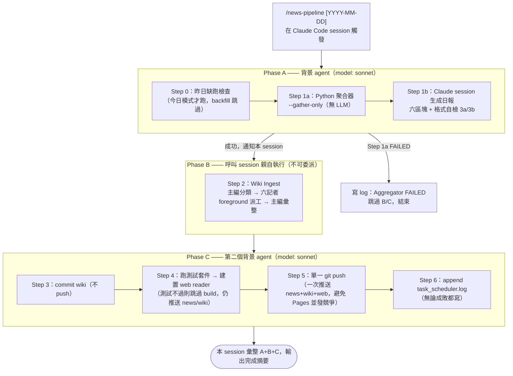
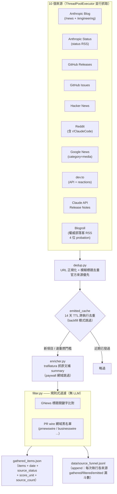
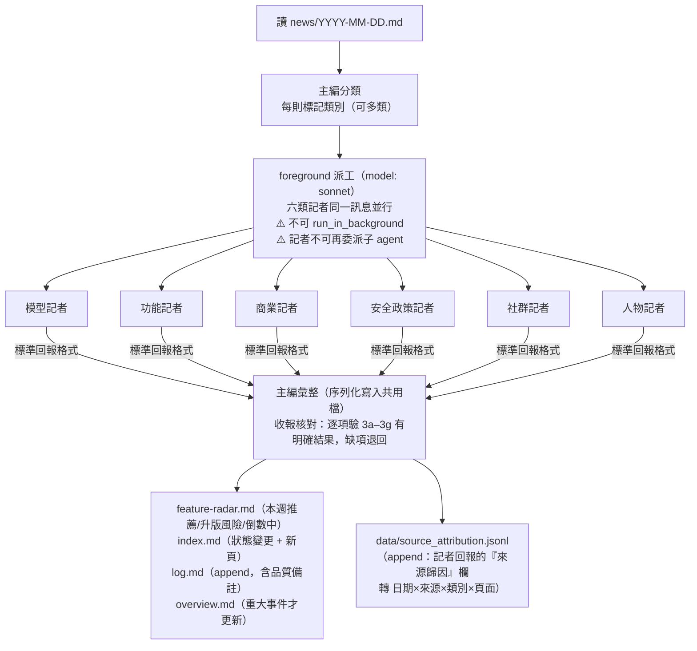
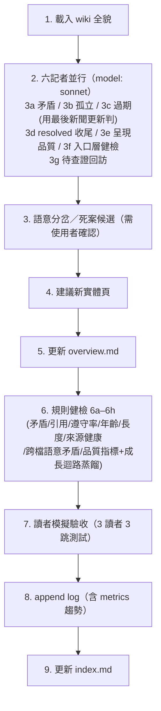
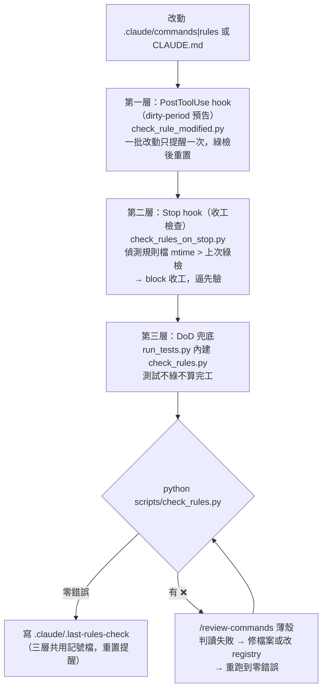
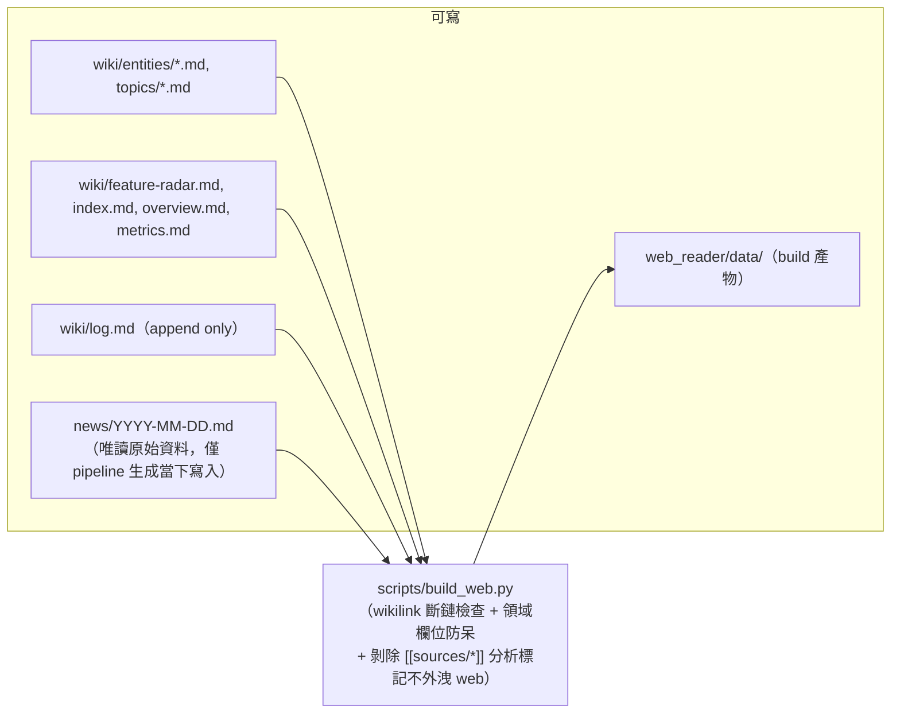

# Design Diagram — 現況架構（維運用）

**最後更新：** 2026-07-11
**文件定位：** 這份是「**系統現在怎麼運作**」的操作/維運架構圖，給要執行或維護 pipeline 的人看。
「**系統怎麼演變成現在這樣**」的演進敘事，另見 `docs/architecture-evolution.html`（互動時間軸），兩者分工不重疊。

> ⚠️ **環境鐵則（讀圖前必知）：**
> - 本專案**沒有 `ANTHROPIC_API_KEY`**，全流程不呼叫任何外部 LLM API。
> - **`claude -p` 全面禁用**。所有 LLM 工作只在 Claude Code session 內完成（日報生成、wiki ingest 派工）。
> - 觸發方式是 `/news-pipeline` skill（在 Claude Code 內執行），**不是** `.bat` + Windows 排程呼叫 `claude -p`。

---

## 全流程總覽（`/news-pipeline`，三段式）

三段拆分的原因：Step 2 要用 Agent tool 派記者，而「背景 agent 再派 agent」會導致完成通知迷路（巢狀背景的系統性限制），所以 Step 2 必須由呼叫 skill 的 session 親自跑。

---

## 聚合器內部（Step 1a：`main.py --gather-only`，全程無 LLM）

**關鍵欄位：**
- `score_unit`：分（HN）/ 讚（Reddit、dev.to）/ 留言 —— 跨來源比熱度時單位不同，不可直接比大小
- `source_count`：同一事件被幾個獨立來源報導，> 1 視為重要度加權
- `source_status`：每個來源本次抓到幾筆（餵給日報「📡 來源狀態」表 + wiki-lint 6f 來源健康檢查）
- `source_funnel.jsonl`：跨日累積的來源漏斗統計（gathered→filtered→emitted），供未來 `/source-review` 判斷各來源效益與部落客汰換（GH Actions 每日 commit）

---

## Wiki Ingest（Step 2：主編 + 六記者，星型派工）

**頁面歸屬＝動態認領：** 記者的負責頁面由 `index.md` 的「領域」欄位決定，不寫死清單；新頁面自動被對應記者涵蓋。

**來源歸因走 ledger、不進 wiki 正文：** 記者在回報訊息填「來源歸因」欄（非 wiki 正文），主編彙整時 append 至 `data/source_attribution.jsonl`。此設計取代了舊的 `[[sources/xxx]]` wikilink 機制（2026-07-11 撤除——wikilink 會污染 web reader 且 Graph 二元邊答不了來源比重問題）。

---

## Wiki Lint（`/wiki-lint`，每週手動，9 步）

---

## 規則一致性治理（三層防線）

`.claude/commands/`、`.claude/rules/`、`CLAUDE.md` 之間有大量交叉引用與同步配對，靠人肉維持一致會漂移。機械檢查已腳本化（`scripts/check_rules.py` 讀 `.claude/review-registry.json`，跑裸露引用/路徑存在/錨點/同步配對四類檢查 + coupling 提示），三層防線確保「改了規則就會被驗」：

**通用化：** 此機制已抽成全域 skill `/build-review-command`（通用引擎 + 專案 registry 分離），可在其他專案快速建立同套三層防線。

---

## 產物與唯讀邊界

**唯讀/限制：** `news/` 唯讀；`log.md` 只能 append；wiki 檔案只能在 `CLAUDE_NEWS/wiki/`；記者不可碰 `feature-radar.md`/`index.md`/`log.md`（主編統一序列化）。

---

## 模組對照（想改哪裡看這裡）

| 想做的事 | 動哪個檔 |
|---------|---------|
| 新增新聞來源 | `src/news_aggregator/sources/` 繼承 `BaseSource`，在 `main.py` sources 列表註冊 |
| 增減權威部落客 | `src/news_aggregator/sources/blogroll.json`（status: probation/active/retired，汰換由 `/source-review` 建議） |
| 改過濾規則 | `src/news_aggregator/filter.py`（純規則，無 LLM） |
| 改日報格式 | `.claude/commands/news-pipeline-steps.md` Step 1b |
| 改記者職責/規則 | `.claude/rules/wiki-ingest-[category].md` |
| 改 web 呈現 | `web_reader/`（設計規範見 `.claude/rules/web-reader-design.md`）+ `scripts/build_web.py` |
| 改任何規則/指令後驗證 | `/review-commands`（判讀 `scripts/check_rules.py` 失敗並修復；機械檢查已掛進 `run_tests.py`） |
| 改規則一致性檢查項 | `.claude/review-registry.json`（同步配對/錨點/allowlist，登記於此即生效） |

執行日誌：`src/logs/` | 測試：`scripts/run_tests.py`
